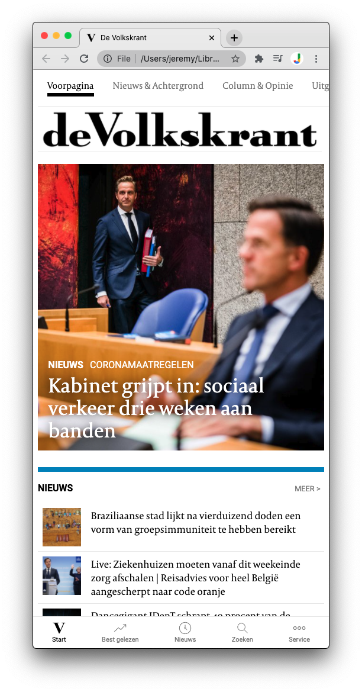
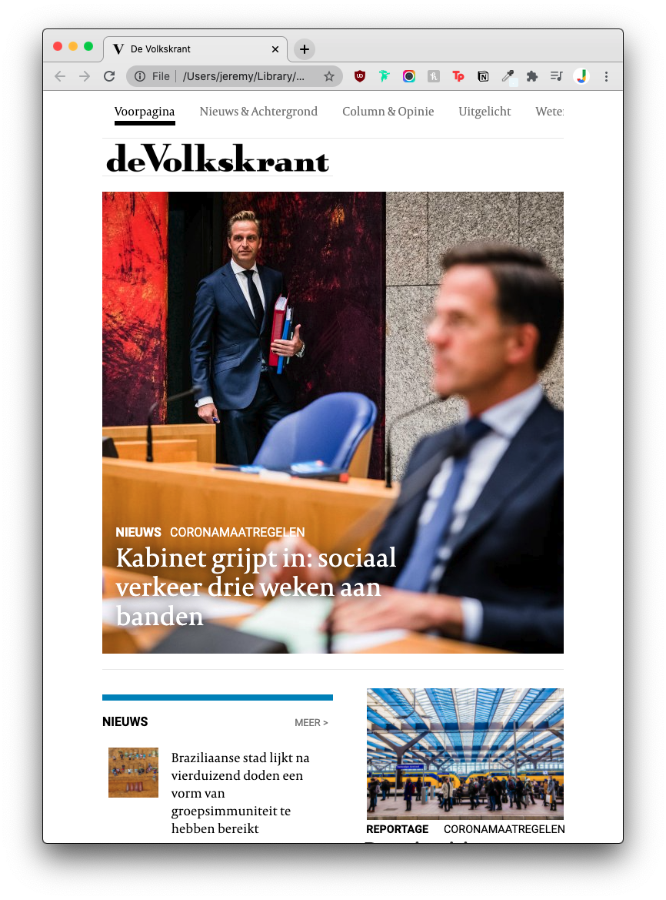
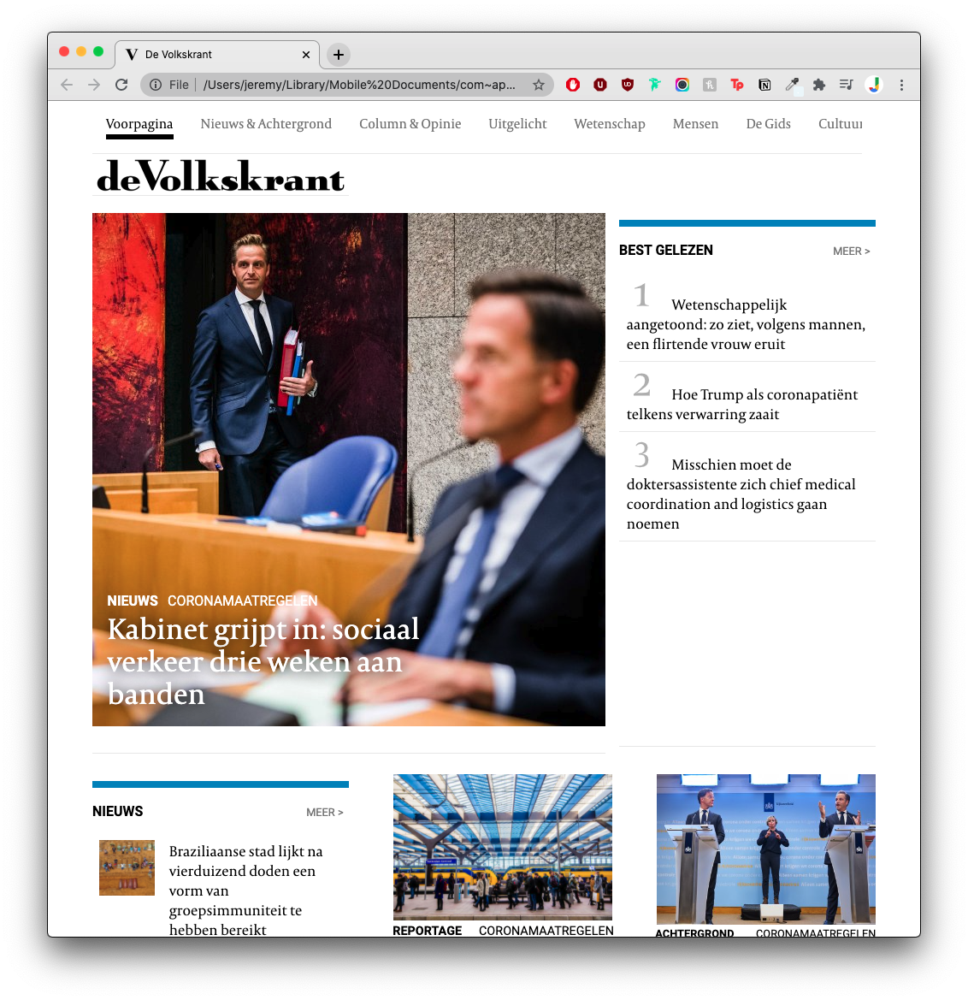
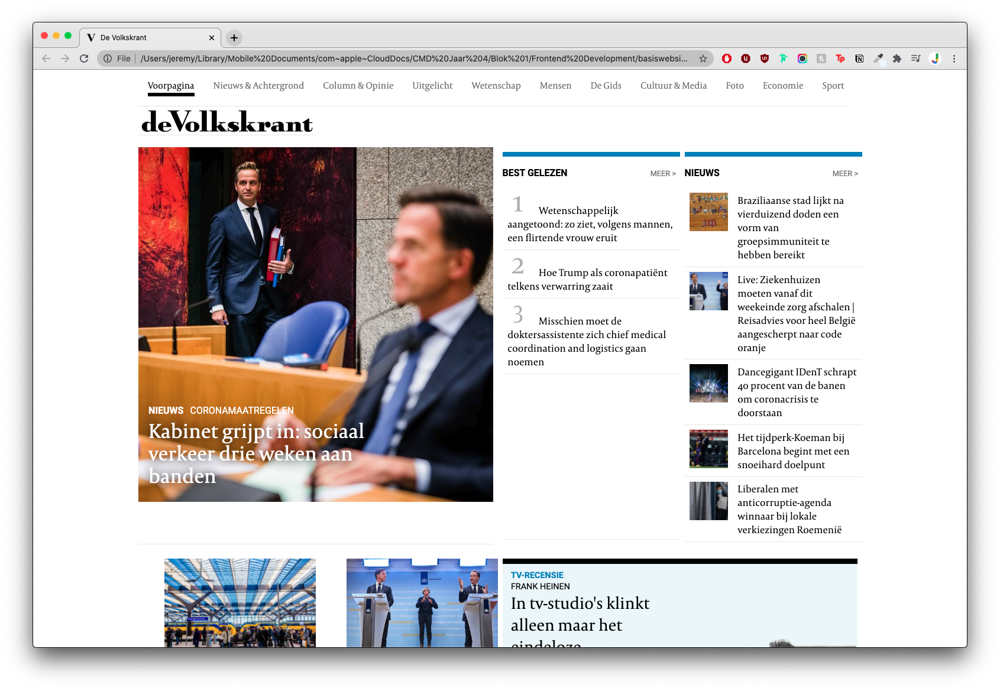
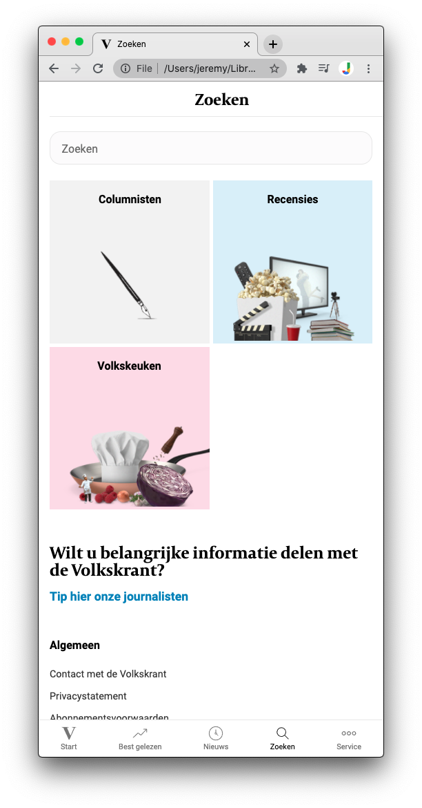
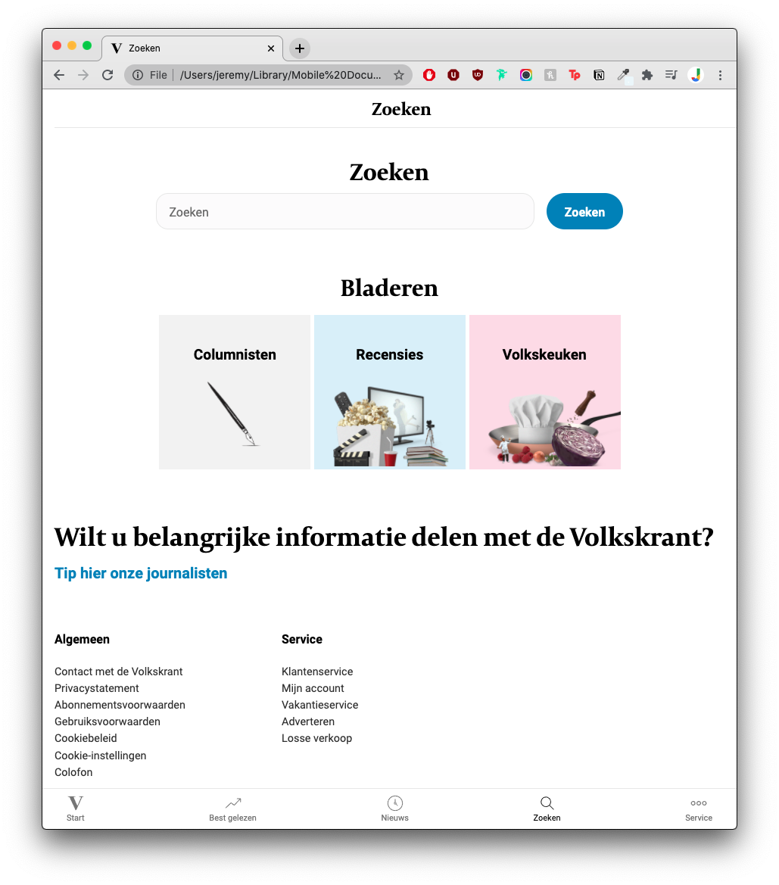
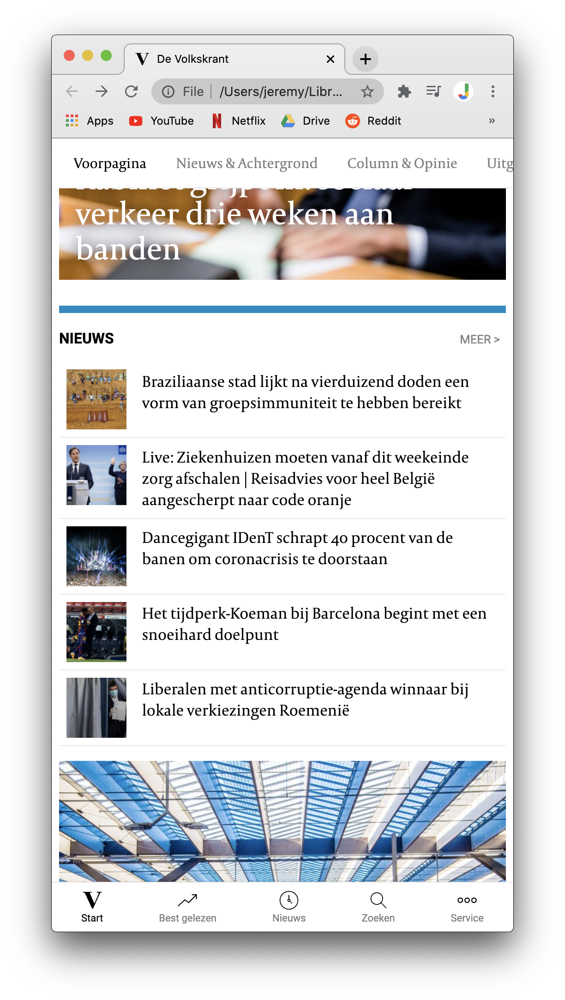
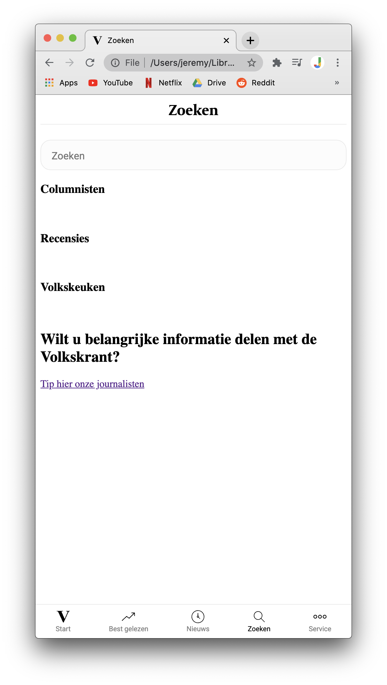

# Procesverslag
**Auteur:** -Jeremy Hansma-

Markdown cheat cheet: [Hulp bij het schrijven van Markdown](https://github.com/adam-p/markdown-here/wiki/Markdown-Cheatsheet). Nb. de standaardstructuur en de spartaanse opmaak zijn helemaal prima. Het gaat om de inhoud van je procesverslag. Besteedt de tijd voor pracht en praal aan je website.

## Bronnenlijst
1. https://css-tricks.com/snippets/css/complete-guide-grid/
2. https://css-tricks.com/snippets/css/a-guide-to-flexbox/
3. https://css-tricks.com/almanac/properties/s/scroll-behavior/
4. https://css-tricks.com/change-color-of-svg-on-hover/

## Eindgesprek (week 7/8)

Ik vond de css zelf erg goed gaan en heb er ook enorm veel van op gestoken. Ook heb ik eigenlijk voor de eerste keer echt plezier gehad in het werken aan de website. Waar ik nog wel wat moeite mee had was de html, ik ben begonnen met de html en toen de css gedaan. Ik merkte al wel snel dat om sommige dingen te laten werken (zoals bijvoorbeeld een goed grid) ik bepaalde dingen in html aan moest passen. Toen ik dit ging veranderen moest ik dan ook weer allemaal css aanpassen om het weer goed te laten werken. Dit was soms een beetje aankloten, maar voor de rest is het erg goed gegaan en heb ik er veel van opgestoken!

**Screenshot(s):**

## Voortgang 3 (week 6)

### Stand van zaken

Ik heb een nieuwe zoekpagina gemaakt en al een klein beetje geprobeerd vorm te geven. Ook heb ik op de hoofdpagina nieuwe stijl elementen toegevoegd om dichterbij de website van de volkskrant te komen. Het is nog steeds niet responsive.

**Screenshot(s):**

## Voortgang 2 (week 5)

### Stand van zaken

Ik heb de belangrijkste elementen op de hoofdpagina al vormgegeven en mis nog een paar kleine details. Het werkt alleen nog wel op mobiel formaat en ik moet het nog responsive maken.

**Screenshot(s):**

## Voortgang 1 (week 3)

### Stand van zaken

CSS ging best goed, ik heb nog moeite met het responsive maken en sommige elementen positioneren gaat ook nog niet zo goed

**Screenshot(s):**

## Intake (week 1)

**Je startniveau:**
Ik heb al best lang niet met code gewerkt en ben er ook nooit echt een superheld in geweest. Ik begin dus sowieso met de blauwe piste, als dit goed gaat zou ik mogelijk ook de rode piste willen proberen, maar dit zie ik later pas.

**Je focus:**
Het lijkt me best leuk om meer aandacht aan de surface laag te spenderen en hier meer over te leren.

**Je opdracht:**
[De Volkskrant](https://www.volkskrant.nl/)

**Screenshot(s):**

**Breakdown-schets(en):**

