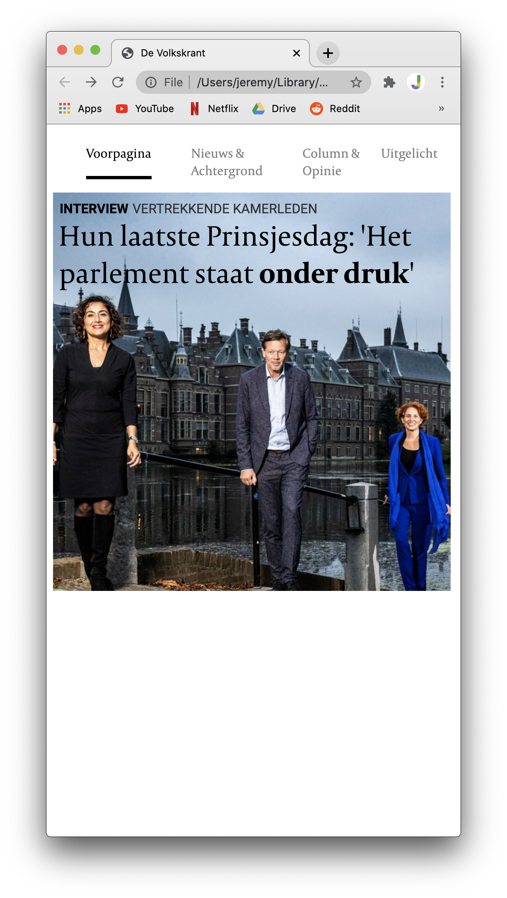

# Procesverslag
**Auteur:** -Jeremy Hansma-

Markdown cheat cheet: [Hulp bij het schrijven van Markdown](https://github.com/adam-p/markdown-here/wiki/Markdown-Cheatsheet). Nb. de standaardstructuur en de spartaanse opmaak zijn helemaal prima. Het gaat om de inhoud van je procesverslag. Besteedt de tijd voor pracht en praal aan je website.

## Bronnenlijst
1. -bron 1-
2. -bron 2-
3. -...-

## Eindgesprek (week 7/8)

-dit ging goed & dit was lastig-

**Screenshot(s):**

-screenshot(s) van je eindresultaat-

## Voortgang 3 (week 6)

-same as voortgang 1-

## Voortgang 2 (week 5)

### Stand van zaken

Ik heb de belangrijkste elementen op de hoofdpagina al vormgegeven en mis nog een paar kleine details. Het werkt alleen nog wel op mobiel formaat en ik moet het nog responsive maken.

**Screenshot(s):**

### Verslag van meeting

-na afloop snel uitkomsten vastleggen-

## Voortgang 1 (week 3)

### Stand van zaken

CSS ging best goed, ik heb nog moeite met het responsive maken en sommige elementen positioneren gaat ook nog niet zo goed

**Screenshot(s):**

## Intake (week 1)

**Je startniveau:**
Ik heb al best lang niet met code gewerkt en ben er ook nooit echt een superheld in geweest. Ik begin dus sowieso met de blauwe piste, als dit goed gaat zou ik mogelijk ook de rode piste willen proberen, maar dit zie ik later pas.

**Je focus:**
Het lijkt me best leuk om meer aandacht aan de surface laag te spenderen en hier meer over te leren.

**Je opdracht:**
[De Volkskrant](https://www.volkskrant.nl/)

**Screenshot(s):**

**Breakdown-schets(en):**

